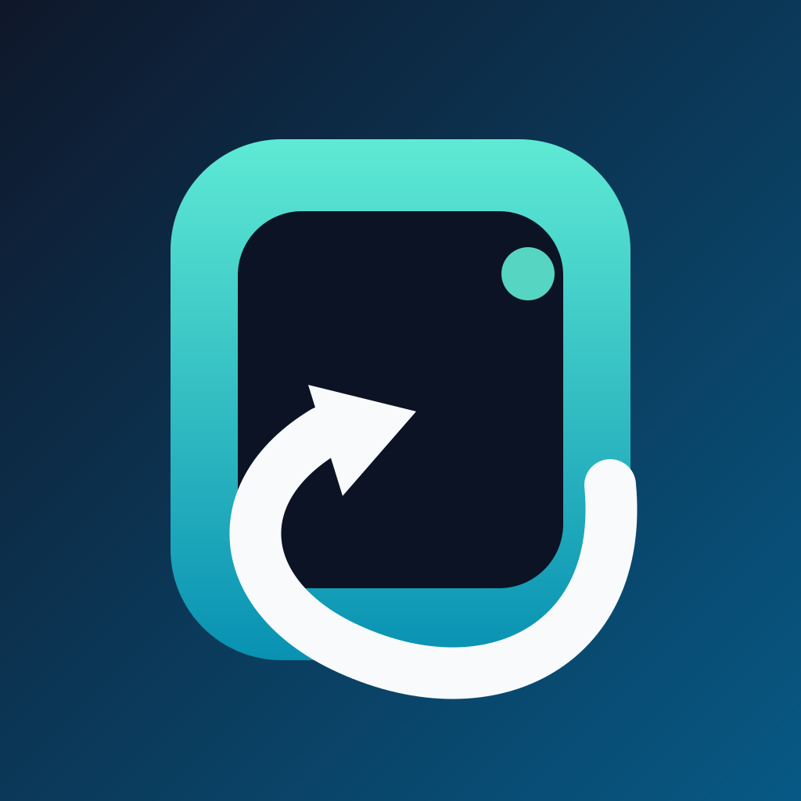
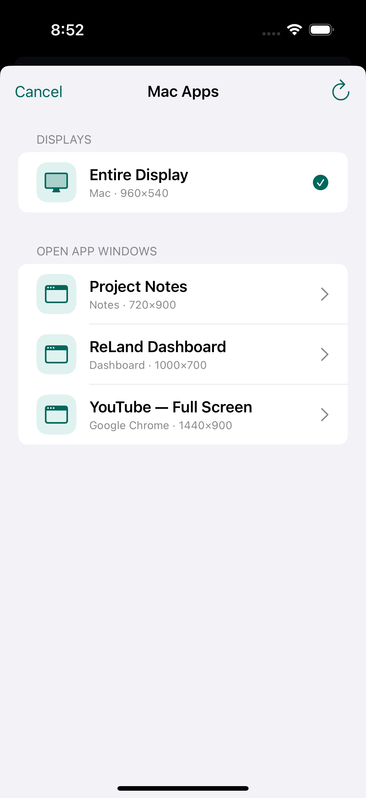
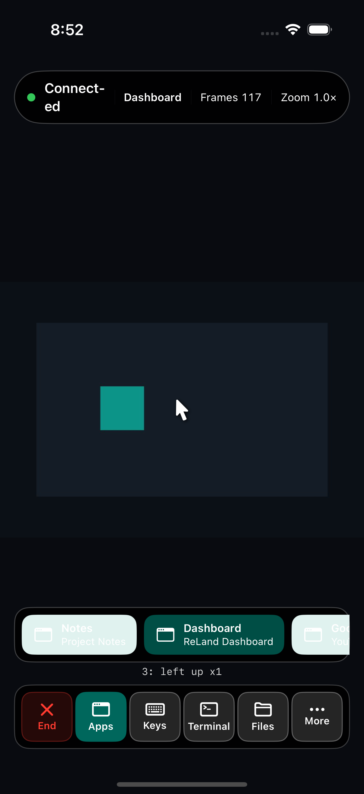
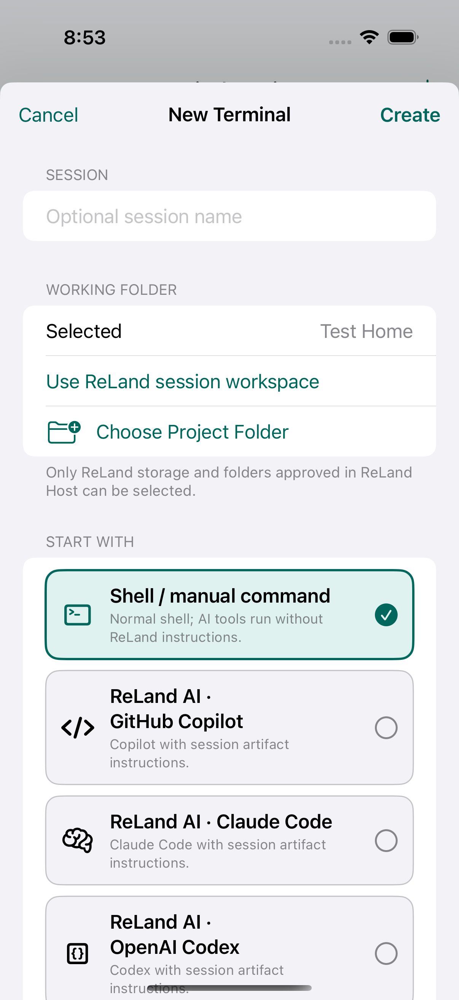

<p align="center">
  
</p>

# ReLand

ReLand is a private remote workspace for your own Mac. From an iPhone or
iPad, you can view and control the Mac screen or a selected app, continue
persistent terminal and AI CLI sessions, and retrieve session artifacts or
approved files.

ReLand does not operate a cloud relay and does not receive your screen,
terminal content, prompts, or files. Connections use your trusted local
network or a private Tailscale network.

In App Mode, swipe horizontally with three fingers to cycle recent Mac
windows. Moving the remote pointer near the bottom edge reveals the ReLand
window strip; select **All Apps** for the complete picker.

The remote action dock keeps Apps, Keyboard, Terminal, Files, and Disconnect
visible. Less-frequent pointer modes, right click, scrolling, zoom reset, and
the gesture guide live under **More**.

> **Status:** public beta. ReLand remains under active security, UX, and
> distribution hardening.

## Install the public beta

- **iPhone and iPad:** [Join ReLand 1.0 on TestFlight][testflight-beta].
- **Mac:** [Download the notarized ReLand Host 1.0 Beta 1][host-beta].

Install both apps, grant ReLand Host the requested Screen Recording and
Accessibility permissions, then pair the phone or tablet using the one-time
QR code.

## App preview

| Choose a Mac app | Control it in App Mode | Start a terminal or AI CLI |
|:--:|:--:|:--:|
|  |  |  |

## Components

- **ReLand** — iOS/iPadOS client.
- **ReLand Host** — macOS capture, input, terminal, and file service.
- **ReLand AI** — session wrapper:
  - `reland-ai copilot`
  - `reland-ai claude`
  - `reland-ai codex`
  - `reland-ai gemini`
- `landai` remains a developer compatibility alias for `reland-ai`.

Reusable ReLand AI arguments can be saved as named launch profiles. Profiles
that include permission-bypass flags are visibly marked and are applied only
after explicit selection; those flags never become an implicit default.

The ReLand icon uses an original window/portal and returning path motif. Its
vector master is in `Design/ReLandIcon.svg`; run
`./Scripts/generate-icons.swift` to regenerate all opaque app-icon assets.

## Prerequisites

- macOS 15 or later.
- iOS/iPadOS 18 or later.
- Xcode with Swift 6 support.
- [XcodeGen](https://github.com/yonaskolb/XcodeGen).
- `tmux` for persistent terminal sessions.
- Both devices on the same trusted LAN, or signed into a private
  [Tailscale](https://tailscale.com/) network.
- Screen Recording and Accessibility permission granted to ReLand Host.

Tailscale is optional when both devices can reach each other on a trusted
private LAN. Tailscale is a separate service with its own terms, plan limits,
and infrastructure.

## Build

```sh
brew install xcodegen tmux
cp Config/Local.xcconfig.example Config/Local.xcconfig
# Set DEVELOPMENT_TEAM in Config/Local.xcconfig for signed device builds.

./Scripts/bootstrap
./Scripts/test-unit
./Scripts/test-e2e-simulator
```

The generated `ReLand.xcodeproj` is intentionally ignored. Change
`project.yml`, then regenerate.

## Pairing and network safety

- Initial pairing requires physical access to the Mac and its one-time QR.
- Pairing codes expire after ten minutes and are consumed once.
- ReLand accepts private LAN, link-local, loopback, IPv6 ULA, and Tailscale
  CGNAT addresses. It rejects public destination addresses.
- ReLand Host should never be exposed directly to the public internet.
- The Mac must be unlocked for app interaction. ReLand does not bypass the
  macOS login screen or system permission prompts.

## Session files

Each managed terminal receives:

```text
~/Library/Application Support/ReLand/TerminalSessions/<session-id>/
├── Artifacts/
├── Instructions/
└── bin/
```

New sessions start in their app-owned session directory instead of the user's
home folder. This avoids broad folder prompts until the user deliberately
chooses a project location. **Choose Project Folder** only lists ReLand
storage and folders explicitly approved in ReLand Host; raw Mac paths are
never accepted from the phone.

Use:

```sh
reland-ai artifact add path/to/file
```

Never place credentials, tokens, private keys, pairing data, or unrelated
personal files in an Artifacts folder.

## Security and privacy

Read:

- [Security policy](SECURITY.md)
- [Privacy](PRIVACY.md)
- [Threat model](docs/THREAT_MODEL.md)
- [Architecture](docs/ARCHITECTURE.md)

ReLand Host is distributed outside the Mac App Store because global input,
ScreenCaptureKit, Terminal/tmux, and local AI CLI integration are not
compatible with App Sandbox. Release builds use Hardened Runtime,
notarization, explicit macOS permissions, and private-network restrictions.

## Contributing

See [CONTRIBUTING.md](CONTRIBUTING.md). Do not include secrets, pairing
payloads, personal screenshots, hostnames, file paths, or terminal content in
issues, tests, or pull requests.

## License

ReLand is licensed under the [Apache License 2.0](LICENSE). Third-party
components retain their own licenses; see
[THIRD_PARTY_NOTICES.md](THIRD_PARTY_NOTICES.md).

[testflight-beta]: https://testflight.apple.com/join/vQqhuAdC
[host-beta]: https://github.com/LandAI-dev/ReLand/releases/tag/v1.0.0-beta.1
